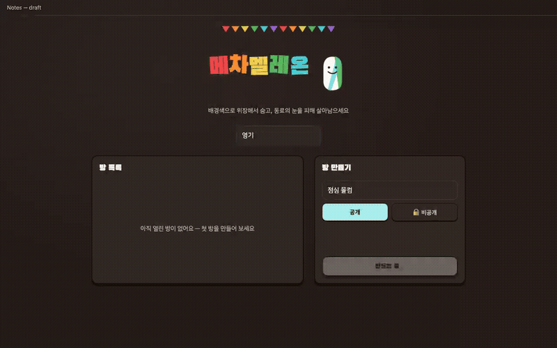
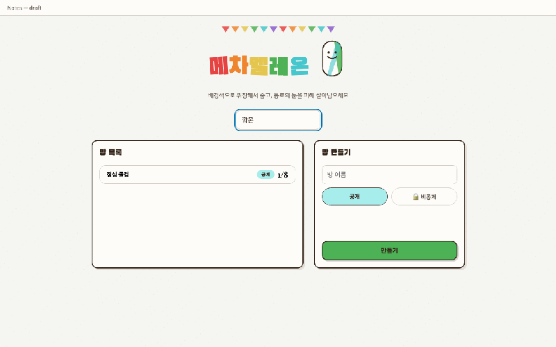

# mechameleon-web

[English](README.md) | **한국어**

[MECCHA CHAMELEON](https://store.steampowered.com/app/4704690/MECCHA_CHAMELEON/)에서 영감을 받은, 업무 중에 동료들과 몰래 즐기는 웹 숨바꼭질 게임. 한 명이 **아무 웹페이지의 스크린샷에서 색을 따와 새하얀 졸라맨을 붓으로 칠해 위장**시키면, 나머지가 화면을 뒤지며 찾아냅니다.

| 숨는 사람 — 칠하고 숨기 | 찾는 사람 — 뒤지고 찾기 |
| --- | --- |
|  |  |

*전체 데모 영상: [숨는 사람](docs/media/demo-hider.webm) · [찾는 사람](docs/media/demo-seeker.webm) — 자동화된 E2E 플레이 녹화본.*

## 게임 구조

- 호스트가 **아무 URL**이나 입력하면 서버가 Playwright로 풀페이지 스크린샷(너비 1440px 고정)을 찍어 무대로 씁니다. 버튼은 눌리지 않는 그냥 픽셀이라, 그 자체로 "일하는 중" 위장 화면이 됩니다. 로그인이 필요한 페이지는 **이미지 직접 업로드**로 대체 가능.
- **기본은 방의 절반이 숨습니다** — 숨는 사람은 랜덤 선발(floor(n/2), 홀수 인원이면 찾는 쪽이 더 많음)이고, 호스트가 대기실 스테퍼로 1명~(인원-1)명 사이에서 조절할 수 있습니다. 숨는 사람들은 서로 떨어진 시작 위치에서 각자 자기 졸라맨을 칠합니다(60초): 방향키로 이동, **마우스 드래그로 붓칠**, 색은 **Alt(⌥)+클릭** 스포이드. 전원이 확정하면(또는 타이머 만료) 바로 수색이 시작됩니다.
- 나머지는 **수색**(120초): 자유롭게 스크롤하며 졸라맨이 있다고 생각하는 곳을 클릭. 빗나가면 **본인만 3초 잠금**되고 빗나간 지점의 은은한 파문이 **전원 화면에** 표시됩니다. 맞히면 그 한 명만 공개되고 게임은 계속 — **전원을 찾아내면 술래 팀 승리**, 시간이 다 되면 **끝까지 숨은 사람들의 승리**입니다.
- 판정은 오직 서버가 — 클릭은 공용 졸라맨 기하에 대해 서버에서 검증됩니다.
- 결과 화면 뒤에는 **10초 카운트다운**("대기실로 돌아갑니다")과 함께 전원이 자동으로 방 대기실로 복귀합니다 — **이전 맵과 숨는 사람 수 설정이 그대로 유지**되어 호스트가 즉시 재대결을 시작하거나 새 URL을 캡처할 수 있습니다.
- **나가기도 정식 기능입니다**: 모든 화면에 나가기 버튼이 있고, 페이지 새로고침 없이 처음 대기실로 돌아갑니다 — 닉네임 유지, 소켓 유지(게임 중에는 실수 방지를 위해 한 번 더 눌러 확인). 방은 마지막 1명까지 유효하며, 호스트가 나가면 남은 사람 중 한 명이 **자동으로 호스트로 승격**되고, 모두 나가면 방이 스스로 사라집니다. 누군가의 이탈로 판이 성립하지 않게 되면 — 2명 미만, 숨는 사람 전원 이탈, 찾는 사람 전원 이탈 — 게임은 **이유를 알려주는 문구와 함께 전원 종료**되고 남은 사람들은 방 대기실로 돌아갑니다.

## 빠른 시작

```bash
git clone https://github.com/choiyounggi/mechameleon-web.git
cd mechameleon-web
npm install
npx playwright install chromium   # 새 머신 최초 1회 — 배경 캡처용 브라우저
npm run build
PORT=3000 npx tsx server/src/index.ts
```

같은 네트워크의 동료에게 `http://<내 IP>:3000`을 공유하세요. 방당 최소 2명, 최대 8명.

## 플레이 방법

1. **로비** — 닉네임 입력 후 방 만들기(공개 또는 **비밀번호가 있는 비공개**) 또는 실시간 방 목록에서 클릭해 입장. 게임이 진행 중인 방은 **"게임 중" 뱃지**가 붙고 판이 끝날 때까지 입장할 수 없습니다.
2. 호스트가 배경 URL을 가져오고(또는 이미지 업로드), 필요하면 "숨는 사람 N명" 스테퍼로 인원 배분을 조절한 뒤(기본: 반반) 2명 이상 모이면 시작.
3. 숨기 / 찾기 / 결과 — 아래 조작법 참고. 숨는 사람이 칠하는 동안 찾는 사람들에게는 스피너와 순환 문구가 있는 대기 화면이 보입니다.
4. 매 판이 끝나면 10초 카운트다운 후 방 전원이 자동으로 대기실로 복귀합니다(맵 유지) — 바로 재시작하거나 맵을 교체하세요.
5. 언제든 나갈 수 있습니다 — 방 대기 화면의 나가기는 즉시, 게임 중에는 버튼이 먼저 "한 번 더 누르면 나가요"로 바뀌어 실수 클릭으로 판에서 빠지는 일을 막아줍니다.

### 조작법 (숨는 사람)

| 동작 | 입력 |
| --- | --- |
| 색칠 | 배경 위에서 **드래그** — 붓질은 스텐실처럼 몸 위에만 묻습니다 |
| 스포이드 | **Alt (맥은 ⌥ Option) + 클릭**으로 배경 픽셀 색 따오기 |
| 이동 | 방향키 (Shift = 빠르게) |
| 크기 | `+` / `-` (0.5×~2×) |
| 확정 | **확정** 버튼 — 숨는 사람 전원이 확정하면(또는 타이머 만료) 수색 시작 |

### 조작법 (찾는 사람)

자유롭게 스크롤하고 클릭으로 지목. 빗나가면 본인만 3초 잠금 + 전원에게 파문 표시.

## 아키텍처

- **npm 워크스페이스**: `shared/`(타입드 Socket.io 프로토콜 + 졸라맨 기하/히트 판정), `server/`(Express + Socket.io 방 엔진, Playwright 캡처), `client/`(Vite + 바닐라 TS, 캔버스 렌더링).
- 모든 실시간 상태는 방 단위 **Socket.io 브로드캐스트**로 흐르고, 방 상태는 서버 메모리에만 존재합니다(DB 없음 — 판이 끝나면 아무것도 남지 않음).
- 붓질은 졸라맨-로컬 좌표의 폴리라인으로 전송되어(프로토콜 스키마로 한도 검증) 이동·크기 변경 시 그림이 몸을 따라가고, 모든 클라이언트가 동일한 몸을 렌더링합니다.

## 개발

```bash
npm test        # shared + server + client (vitest)
npm run build   # 타입체크 + 클라이언트 번들
```

Playwright 기반 E2E 자동 플레이 스크립트도 포함되어 있으며(실행 후 `e2e-videos/` 참고), 위 데모 미디어가 바로 그 산출물입니다.

## 참고 및 한계

- 의도적으로 단일 서버 인스턴스(메모리 방 상태) — 사무실 규모용이지 인터넷 규모용이 아닙니다.
- 재대결이 기본 흐름입니다: 매 판이 끝나면 10초 뒤 같은 방 대기실로 자동 복귀하며 맵이 유지됩니다.
- 캡처 엔드포인트는 http(s) 스킴 검증만 하고 서버에서 URL을 가져옵니다 — 신뢰할 수 있는 LAN에서 운용하세요.
- 팬 오마주: 게임 컨셉은 MECCHA CHAMELEON에서 영감을 받았습니다. 에셋·코드·아트는 일절 복제하지 않았고, 시각적 DNA(페인트 위장 마스코트, 글자별 색 타이틀)는 처음부터 새로 만들었습니다.
